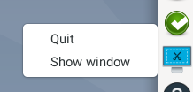
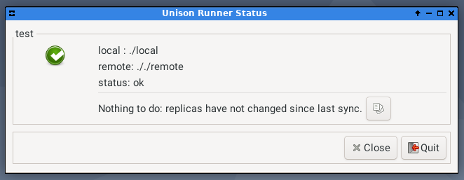
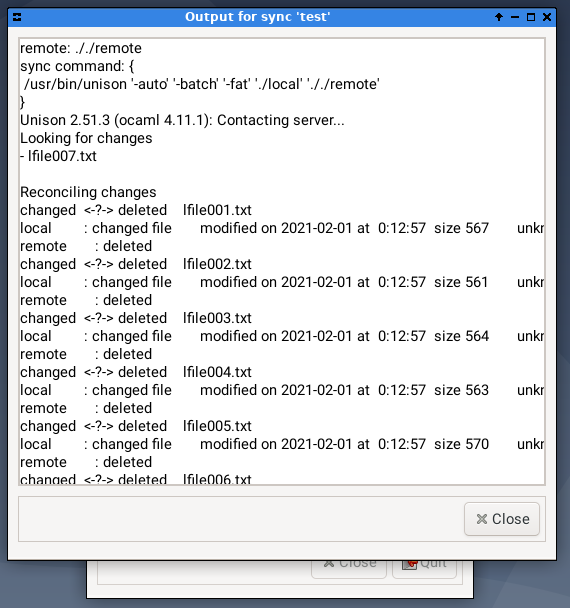

# unison-runner

Unison Runner is a tool to keep directories in sync using Unison.
It shows up in the systray and show you the current synchronization status
of your directories (up-to-date, syncing, offline, etc).

It doesn't handle any of the synchronization, that is left to unison, and
it doesn't not try to be smart on how to use unison. It does very little.

It uses a config file, by default in ~/.config/unison-runner.cfg, but a
different one can be passed with **-c <filepath>**.

## systray status icon

The main feature of the unison runner is it systray status icon. The icon
allows knowing in a glance what is the current status of the synchronization.

 - this means all the syncs have
runned without issues the last time.

 - when this icon shows up, one or
more of the synchronizations failed.

 - when the
systray shows this icon, the unison runner is currently running one or
more unison instances.

By clicking in the icon the main window is showed (or bought to top), and
by clicking on the icon with the second mouse button a small menu is shown:

## windows

The main window can be shown by clicking on the systray icon and it shows
a list of all the configured synchronizations, including their current
status and the last line of the last synchronization run.

By clicking on the button on the right of the last log line you can see the
whole output of the last unison run - inclucing a bit of information about
the command that was executed.

This window shows the output of the last synchronization run.

## configuration

This is the config file you can find in the test directory. Just a few
options are supported for each synchronization

~~~ini

#netroot = root of the remote directories
netroot       = .
#max_children = the max number of unison synchs running at the same time
max_children  = 1
#frequency = how often is each folder sync'd.
frequency     = 10

[test]
local   = local
remote  = remote

# [sync-name]
# local = [needed] path of the local directory
# remote = [needed] path of the remote directory
# paths = paths,to,sync - list of paths to synchronize - sync only these paths
# excludes=paths,to,exclude - list of paths to exclude - these are not sync'd

~~~

## potential WTFs

* **skiped is remote is empty** - I use this to synchronize between my
desktop and my SMB NAS. I mount the NAS using ftab mounts. In my setup
if the remote directory is empty, it means that the share was not mounted,
so I don't want to run unison on that empty directory. If you are starting
to sync files to a new, empty share, you can manual run the unison command
once - you can get it from the log window of your sync.

* **smbnetfs doesn't work** - well, maybe it does for you, but I didn't
manage to make it work on my setup, and didn't want to spend too much time
time making it work, specially because I don't have problems mounting my
shares with ftab entries. If you manage to make unison work with smbnetfs
tell me how, please.

